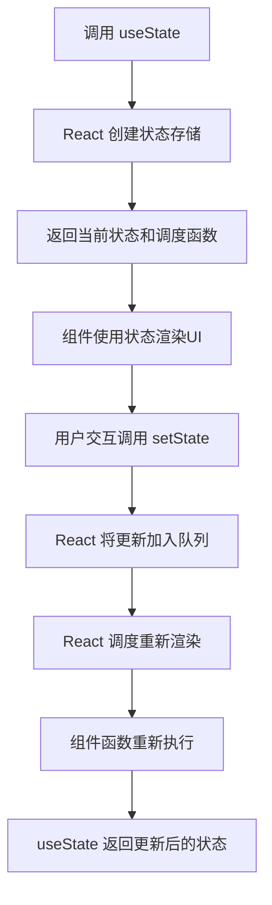

你指出了一个非常好的问题！这正是 React 设计精妙之处。让我解释为什么不需要（也不能）像你描述的那样手动实现 `setFilterText` 函数：

### React 的 useState 魔法

在 React 中，当我们写：

```jsx
const [filterText, setFilterText] = useState("");
```

**React 实际上在背后为我们实现了类似这样的机制：**

```javascript
// 伪代码：React 内部的实现逻辑（简化版）
let componentState; // React 内部存储状态

function useState(initialValue) {
  // 1. 检查是否是首次渲染
  if (!componentState) {
    componentState = initialValue;
  }

  // 2. 创建状态更新函数（这就是我们得到的 setFilterText）
  const setState = (newValue) => {
    // 通知 React 调度更新
    scheduleUpdate(() => {
      // 更新内部状态
      componentState = newValue;

      // 重新渲染组件
      renderComponent();
    });
  };

  // 3. 返回当前状态和更新函数
  return [componentState, setState];
}
```

### 为什么不需要手动实现？

1. **闭包与作用域问题**
   如果我们像你建议的那样写：

   ```jsx
   const [filterText, setFilterText] = useState("");

   // ❌ 这样写是无效的
   setFilterText = function (string) {
     filterText = string; // 这里会报错：Assignment to constant variable
   };
   ```

   - `filterText` 是 `const` 常量，不能直接重新赋值
   - 即使使用 `let`，修改的也只是当前函数作用域的局部变量

2. **跨渲染周期的状态持久化**
   React 组件函数每次渲染都会重新执行，局部变量会被重置。React 需要在函数调用之间保持状态，这需要：

   - 外部存储状态（在 React 内部）
   - 将状态与特定组件实例关联

3. **更新调度与批处理**
   真正的 `setFilterText` 需要：
   - 通知 React 安排重新渲染
   - 批量处理多个状态更新
   - 确保更新顺序和一致性

### React 的实际工作流程



### 关键差异

| 特性           | 手动实现                 | React 的 useState              |
| -------------- | ------------------------ | ------------------------------ |
| **状态存储**   | 局部变量（每次渲染重置） | React 内部存储（跨渲染持久化） |
| **更新机制**   | 直接赋值（同步）         | 调度更新（可能异步批处理）     |
| **重新渲染**   | 不会触发                 | 自动触发组件重新渲染           |
| **作用域**     | 当前函数作用域           | 与组件实例关联                 |
| **多状态管理** | 需要手动处理             | 自动跟踪多个状态               |

### 为什么这个设计更好？

1. **声明式编程**：我们只需要声明"状态应该是什么"，而不是"如何更新状态"
2. **自动重新渲染**：调用 setter 函数会自动触发整个更新流程

   ```jsx
   // 我们只需要这样写
   setFilterText("apple");

   // 不需要关心：
   // - 如何更新DOM
   // - 何时重新渲染
   // - 状态如何存储
   ```

3. **性能优化**：React 可以批量处理多个状态更新

4. **函数式纯度**：组件函数是纯函数，接收 props 返回 UI，状态更新由 React 管理

### 总结

React 的 `useState` 不是简单的变量赋值工具，而是一个**状态管理系统**：

1. 当我们调用 `useState`，React 在内部创建状态存储
2. 返回的 setter 函数是一个"调度命令"，而不是直接赋值
3. 调用 setter 会触发 React 的更新周期
4. 在下次渲染时，`useState` 会返回更新后的值

这种设计使得：

- 状态管理变得简单（我们只需调用 setter）
- 更新逻辑与渲染逻辑解耦
- 性能优化成为可能
- 代码更可预测和可维护

所以，虽然表面上看起来像是"通过传递函数改变变量"，但实际上背后是 React 精心设计的状态管理机制，远比简单的变量赋值复杂得多！
