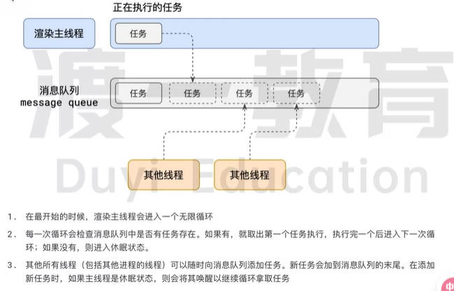

# 浏览器事件循环（Event Loop）详解

## 目录

- [浏览器的进程模型](#浏览器的进程模型)
  - [什么是进程](#什么是进程)
  - [什么是线程](#什么是线程)
  - [浏览器的进程和线程](#浏览器的进程和线程)
- [渲染主线程的工作原理](#渲染主线程的工作原理)
  - [渲染主线程的任务](#渲染主线程的任务)
  - [任务调度机制](#任务调度机制)
- [事件循环（Event Loop）](#事件循环event-loop)
  - [消息队列](#消息队列)
  - [事件循环的工作流程](#事件循环的工作流程)
- [JavaScript的异步机制](#javascript的异步机制)
  - [为什么需要异步](#为什么需要异步)
  - [JavaScript的单线程特性](#javascript的单线程特性)
  - [异步的实现方式](#异步的实现方式)
- [JS执行对渲染的影响](#js执行对渲染的影响)
  - [案例分析](#案例分析)
- [任务优先级](#任务优先级)
  - [不同类型的任务队列](#不同类型的任务队列)
  - [优先级排序](#优先级排序)
- [常见面试题解析](#常见面试题解析)
  - [描述JavaScript的事件循环](#描述javascript的事件循环)
  - [JS中的计时器能做到精确计时吗](#js中的计时器能做到精确计时吗)
- [总结](#总结)

## 浏览器的进程模型

浏览器是一个复杂的多进程多线程应用程序，其内部工作机制十分复杂。要理解事件循环，首先需要了解浏览器的进程模型。

### 什么是进程

进程是程序运行时的实例，每个进程都有自己的专属内存空间。可以简单理解为：

- 每个应用程序至少有一个进程
- 进程之间相互独立，互不干扰
- 进程是资源分配的基本单位

### 什么是线程

线程是进程内的执行单元：

- 一个进程至少有一个线程，称为主线程
- 如果程序需要同时执行多个任务，就需要开启其他线程
- 线程是CPU调度的基本单位

### 浏览器的进程和线程

现代浏览器通常包含以下几个主要进程：

1. **浏览器进程**：负责浏览器的界面显示、用户交互、子进程管理等
2. **网络进程**：负责加载网络资源
3. **渲染进程**：负责将HTML、CSS、JavaScript转换为用户可以交互的网页
   - 每个标签页通常会有自己的渲染进程
   - 渲染进程内包含多个线程，其中最重要的是渲染主线程



## 渲染主线程的工作原理

渲染主线程是浏览器中最繁忙的线程，它负责处理大部分与页面展示和交互相关的工作。

### 渲染主线程的任务

渲染主线程需要处理的任务包括但不限于：

- 解析HTML
- 解析CSS
- 计算样式
- 布局
- 处理图层
- 每秒将页面绘制60次（60fps）
- 执行全局JavaScript代码
- 执行事件处理函数
- 执行计时器的回调函数

### 任务调度机制

渲染主线程如何调度这些任务？

1. 渲染主线程会进入一个**无限循环**
2. 每一次循环会检查消息队列中是否有任务存在
   - 如果有，取出第一个任务执行，执行完后进入下一次循环
   - 如果没有，则进入休眠状态
3. 其他线程（包括其他进程的线程）可以随时向消息队列添加任务
   - 新任务会加到消息队列的末尾
   - 如果主线程处于休眠状态，则会被唤醒以继续循环处理任务

## 事件循环（Event Loop）

事件循环是浏览器渲染主线程的工作方式，也是JavaScript异步编程的核心机制。

### 消息队列

消息队列是事件循环的核心组成部分：

- 它是一个先进先出（FIFO）的队列数据结构
- 队列中的每一项都是一个待执行的任务
- 任务来源多样：JavaScript执行、用户交互、网络请求等

### 事件循环的工作流程

事件循环的基本工作流程如下：

1. 从消息队列中取出第一个任务执行
2. 执行完当前任务后，检查微任务队列，执行所有微任务
3. 如果需要，执行UI渲染
4. 然后再次检查消息队列，重复上述过程


## JavaScript的异步机制

### 为什么需要异步

在JavaScript执行过程中，会遇到一些无法立即处理的任务，例如：

- 计时完成后需要执行的任务（setTimeout、setInterval）
- 网络通信完成后需要执行的任务（XHR、Fetch）
- 用户操作后需要执行的任务（addEventListener）

如果让渲染主线程等待这些任务的时机达到，就会导致主线程长期处于"阻塞"状态，从而导致浏览器卡死。

### JavaScript的单线程特性

JavaScript是一门单线程语言，这是因为：

- JavaScript运行在浏览器的渲染主线程中，而渲染主线程只有一个
- 渲染主线程承担着诸多工作：渲染页面、执行JavaScript等
- 如果使用同步方式处理所有任务，极有可能导致主线程阻塞

### 异步的实现方式

浏览器采用异步方式来避免主线程阻塞：

1. 当遇到异步任务（如计时器、网络请求、事件监听）时，主线程将任务交给其他线程处理
2. 主线程立即结束当前任务的执行，继续执行后续代码
3. 当其他线程完成任务时，将事先传递的回调函数包装成任务，加入到消息队列末尾
4. 主线程在当前任务执行完毕后，会从消息队列中取出任务继续执行

在这种异步模式下，浏览器永不阻塞，从而最大限度地保证了单线程的流畅运行。


## JS执行对渲染的影响

### 案例分析

以下代码展示了JavaScript执行如何阻碍页面渲染：

```html
<h1>You is awesome!</h1>
<button>change</button>
<script>
var h1 = document.querySelector('h1');
var btn = document.querySelector('button');
//死循环指定的时间
function delay(duration){
  var start = Date.now();
  while (Date.now() - start < duration){}
}
btn.onclick = function (){
  h1.textContent = '你很帅！';
  delay(3000);
};
</script>
```

当点击按钮后：
1. h1的文本内容已经在JavaScript中被修改为"你很帅！"
2. 但由于随后执行了一个耗时3000ms的死循环（delay函数）
3. 渲染任务被阻塞，无法立即更新页面
4. 只有在JavaScript执行完毕后，渲染任务才能执行，用户才能看到文本变化

这个例子清晰地展示了JavaScript执行如何阻碍页面渲染，以及为什么长时间运行的JavaScript会导致页面卡顿。

## 任务优先级

在现代浏览器中，任务队列的概念已经比简单的宏队列和微队列更加复杂。

### 不同类型的任务队列

根据W3C规范，任务可以分为不同的类型，同类型的任务必须在同一个队列，不同类型的任务可以属于不同的队列。

常见的任务队列包括：

1. **微任务队列（Microtask Queue）**：Promise回调、MutationObserver等
2. **交互队列（Interaction Queue）**：用户交互事件（如点击、滚动等）
3. **延时队列（Delayed Queue）**：setTimeout、setInterval等

### 优先级排序

不同任务队列有不同的优先级，一般来说：

**微任务队列 > 交互队列 > 延时队列**

在一次事件循环中，浏览器会根据优先级决定从哪个队列取任务。但根据W3C规范，微任务队列始终具有最高优先级，必须优先调度执行。

## 常见面试题解析

### 描述JavaScript的事件循环

**参考答案**：

事件循环（Event Loop）又叫做消息循环，是浏览器渲染主线程的工作方式。

在Chrome的源码中，它开启一个不会结束的for循环，每次循环从消息队列中取出第一个任务执行，而其他线程只需要在合适的时候将任务加入到队列末尾即可。

过去把消息队列简单分为宏队列和微队列，这种说法目前已无法满足复杂的浏览器环境，取而代之的是一种更加灵活多变的处理方式。

根据W3C官方的解释：
- 每个任务有不同的类型，同类型的任务必须在同一个队列
- 不同的任务可以属于不同的队列
- 不同任务队列有不同的优先级，在一次事件循环中，由浏览器自行决定取哪一个队列的任务
- 浏览器必须有一个微队列，微队列的任务一定具有最高的优先级，必须优先调度执行

### JS中的计时器能做到精确计时吗

**参考答案**：

不能，JavaScript的计时器无法做到精确计时，原因如下：

1. **硬件限制**：计算机硬件没有原子钟，无法做到精确计时
2. **操作系统偏差**：操作系统的计时函数本身就有少量偏差，由于JS的计时器最终调用的是操作系统的函数，也就携带了这些偏差
3. **浏览器实现限制**：按照W3C的标准，浏览器实现计时器时，如果嵌套层级超过5层，则会带有4毫秒的最少时间，这样在计时时间少于4毫秒时又带来了偏差

Chrome源码中的相关实现：

```c++
namespace{
//Step 11 of the algorithm at
//https://html.spec.whatwg.org/multipage/timers-and-user-prompts.html requires
//that a timeout less than 4ms is increased to 4ms when the nesting level is
//greater than 5.
// https://html.spec.whatwg.org/multipage/timers-and-user-prompts.html要求
//当嵌套级别为5时，小于4 ms的超时增加到4 ms
//大于5。
constexpr int kMaxTimerNestingLevel = 5; 
constexpr base::TimeDelta kMinimumInterval = base::Milliseconds(4);
}
//namespace
```

4. **事件循环影响**：受事件循环的影响，计时器的回调函数只能在主线程空闲时运行，因此又带来了偏差

## 总结

- **单线程是异步产生的原因**：JavaScript的单线程特性决定了它需要异步机制来避免阻塞
- **事件循环是异步的实现方式**：通过事件循环机制，JavaScript能够在单线程环境下实现非阻塞的异步操作
- **任务队列有优先级**：不同类型的任务队列具有不同的优先级，微任务队列优先级最高
- **JavaScript执行会阻碍渲染**：长时间运行的JavaScript会阻塞渲染任务，导致页面卡顿
- **计时器不精确**：由于多种因素的影响，JavaScript的计时器无法做到精确计时

理解浏览器的事件循环机制，对于编写高性能、非阻塞的JavaScript代码至关重要。通过合理利用异步编程模式，可以最大限度地保证页面的流畅响应和良好的用户体验。
