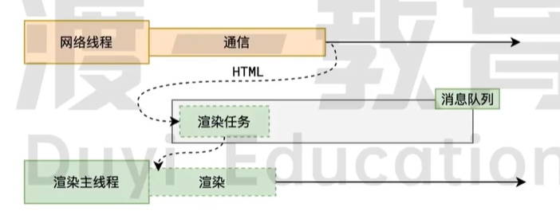
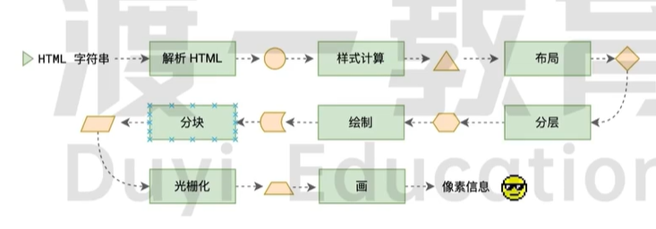

# 浏览器是如何渲染页面的

渲染 render
把 html 字符串 渲染成 画面的像素
和 vue react render 不同

### 两句话

当浏览器的网络线程收到 HTML 文档后，会产生一个渲染任务，并将其传递给渲染主线程的消息队列。
在事件循环的作用下，渲染主线程取出消息队列中的渲染任务，开启渲染流程。

### 渲染流程

html 解析---> 样式计算----> 布局------->分层---->绘制----->分块----->光栅化。
每个阶段都有明确的输入输出，上一个阶段的输出会成为下一个阶段的输入。
这样，这个渲染流程就形成一套严密的生产流水线。
第一步是解析 html
解析过程中遇到 css 解析 css,遇到 js 执行 js 为了提高解析效率，浏览器在开始解析前会启动一个预解析的线程，率先下载 html 中的外部 css 文件和外部的 js 文件。
如果主线程解析到 link 位置，此时外部的 css 文件还没有下载解析好，主线程不会等待
而是继续解析后续的 html，这是因为下载和解析 css 的工作是在预解析线程中进行的。这就是 css 不会堵塞 html 解析度根本原因。
如果主线程解析到 script 位置，会停止解析 HTML，转而等待 js 文件下载好并将全局代码解析执行完成后
，才能继续解析 html。这是因为 js 代码执行过程中可能会修改当前 DOM 树，所以 DOM 树的生成必须暂停。这就是 js 会堵塞 hmtl 解析的根本原因。
在第一步完成后，会得到 DOM 树和 CSSDOM 树，浏览器的默认样式。内部样式。外部样式均包含在 CSSDOM 树中。

## 什么是 reflow?

## 什么是 repaint?

## 为什么 transform 执行很快？
