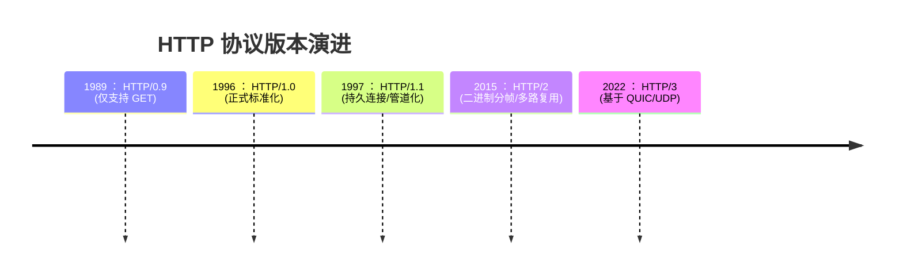
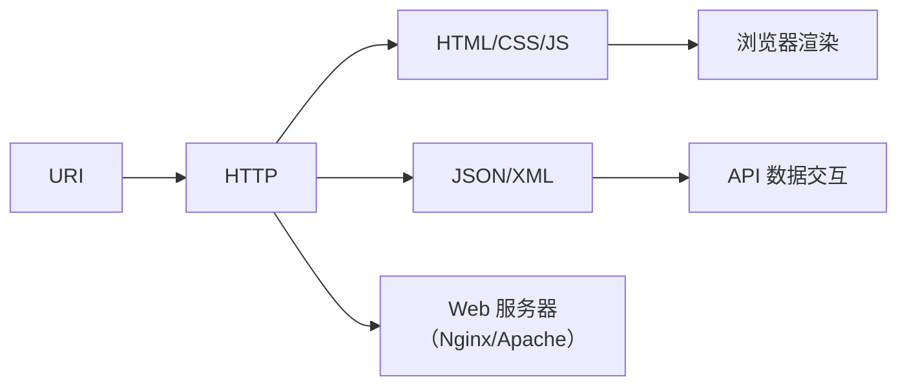

## http 定义

**HTTP（Hypertext Transfer Protocol，超文本传输协议）** 是一种基于 **客户端-服务器（Client-Server）模型** 的 **应用层协议**，最初设计用于在万维网（World Wide Web）中传输超文本文档。其核心定义可拆解为以下关键点：

### 1. **核心功能**

- **传输超媒体文档**：  
  超文本（Hypertext）指通过超链接（Hyperlink）相互关联的文本，现扩展为 **超媒体（Hypermedia）**，包含：
  - 结构化文本（HTML/XML）
  - 图像、音频、视频等二进制资源
  - 脚本（JavaScript）、样式表（CSS）
  - 结构化数据（JSON/XML）
- **资源定位与交互**：  
  通过 **URI/URL（统一资源标识符/定位符）** 标识网络资源，支持对资源的获取、修改、删除等操作。

### 2. **协议特性**

| 特性              | 说明                                                               |
| ----------------- | ------------------------------------------------------------------ |
| **无连接性**      | 默认基于短连接（早期），HTTP/1.1 后支持持久连接（Keep-Alive）      |
| **无状态性**      | 服务器不保存客户端上下文（需 Cookie/Session/JWT 等实现状态保持）   |
| **请求-响应模型** | 客户端发起请求 → 服务器返回响应（单向通信）                        |
| **可扩展性**      | 支持自定义头部（Headers）、方法（Methods）、状态码（Status Codes） |
| **协议无关性**    | 下层可承载于 TCP、TLS（HTTPS）或 QUIC（HTTP/3）等传输协议          |

### 3. **技术演进**

### 4. **现代应用扩展**

- **API 通信**： RESTful API 的核心传输协议（请求/响应体多为 JSON/XML）
- **实时通信**： 基于 WebSocket（HTTP 升级协议）实现双向数据流
- **微服务架构**： 服务间通信的基础协议（如 gRPC 基于 HTTP/2）
- **内容分发**： CDN 依赖 HTTP 缓存头（`Cache-Control`, `ETag`）优化资源分发

### 5. **与 Web 技术栈的关系**

### 定义表述

> HTTP 是万维网（WWW）的基础通信协议，工作在 **应用层**，采用 **请求-响应** 模型传输超媒体文档（如 HTML、图像、JSON 等）。它通过 URI 定位资源，使用标准方法（GET/POST 等）操作资源，具有 **无状态、可扩展、协议无关** 等特性。现代 HTTP 已从简单的文档传输协议演进为支持 API 交互、实时通信、微服务架构的核心网络协议。
